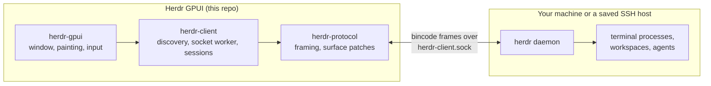

<p align="center">
  
</p>

<h1 align="center">Herdr GPUI</h1>

<p align="center">
  <a href="https://github.com/penso/herdr-gpui/actions/workflows/ci.yml"></a>
</p>

<p align="center">
  <a href="https://github.com/penso/herdr-gpui/releases">Releases</a> ·
  <a href="docs/updating.md">App updates</a> ·
  <a href="crates/herdr-gpui/README.md">GUI scope &amp; configuration</a> ·
  <a href="crates/herdr-gpui/PERFORMANCE.md">Performance report</a> ·
  <a href="AGENTS.md">Contributing</a>
</p>

A native Rust/GPUI client for a [Herdr](https://herdr.dev/) daemon you installed
yourself. It paints the daemon's terminal cells, split panes included, without
running another terminal emulator or wrapping the TUI.

> **Unaffiliated project.** Not affiliated with, endorsed by, or supported by
> Herdr or [herdr.dev](https://herdr.dev/).

## Install

### macOS with Homebrew

Requires [Homebrew](https://brew.sh/) and macOS 15 Sequoia or newer, on Apple
Silicon or Intel. The cask installs the signed, notarized universal app.

```sh
brew install penso/tap/herdr-gpui
open -a Herdr
```

`brew install` resolves casks directly, so `--cask` is not required. To update it
later, or to install by its short name, tap once first:

```sh
brew tap penso/tap
brew install herdr-gpui
```

The cask is published from the [tap](https://github.com/penso/homebrew-tap) by the
release workflow. A cask install updates itself through Homebrew: the in-app
updater detects that Homebrew owns the bundle and runs `brew upgrade --cask
herdr-gpui` for you, so Homebrew's records stay correct. macOS `.dmg`, experimental Linux tarballs, and an experimental Windows `.zip`
are also published on [Releases](https://github.com/penso/herdr-gpui/releases).

### From source

Install Rust/rustup and, on macOS, the Xcode command-line tools. The repository
pins Rust 1.96.1 and GPUI 0.2.2; the Rust version is declared in `rust-toolchain.toml`
and mirrored in `mise.toml`, so `mise install` also provisions it.

```sh
git clone https://github.com/penso/herdr-gpui.git
cd herdr-gpui
just run
```

`just run` uses the optimized release build; `just run-debug` is notably slower
with a dense terminal on screen. Without `just`: `cargo run --locked --release -p herdr-gpui`.

Install the Herdr daemon separately. The app starts an already-installed local
`herdr server` when the target session is absent, but never installs, stops, or
upgrades a daemon; removing the GUI leaves daemon sessions and shared Herdr
configuration intact.

### Linux Builds

On Ubuntu 24.04 (x86_64 or ARM64), run `bash scripts/install-linux-deps.sh`
before building. This installs GPUI's X11/Wayland/font development dependencies
and `libasound2-dev` for Rodio/CPAL native audio. CI and release builds use the
same script. Linux binaries require the system ALSA shared library (`libasound2t64`
on Ubuntu 24.04), a configured default audio device, and Vulkan for rendering.
Audio normally routes through the desktop's ALSA plugin configuration; no CLI
audio player is required. Custom notification sounds are MP3 only. See
[notification sounds](crates/herdr-gpui/README.md#notification-sounds).

### Windows

Windows is experimental, not a supported platform: CI lints every target and
feature on `windows-2025`. The release workflow runs the protocol and client
test suites, builds the optimized executable, and tests its CLI, but no window,
renderer, or live daemon has been exercised. Local
connections use the named pipe the Windows daemon binds, and configuration and
state follow its `%APPDATA%` / `%LOCALAPPDATA%` layout. Saved SSH
hosts, in-app updates, saved GitHub credentials, and the avatar disk cache are
unavailable and report that plainly; see
[the GUI README](crates/herdr-gpui/README.md#windows).

Each release publishes `Herdr-VERSION-x86_64-pc-windows-msvc.zip` containing
`herdr-gpui.exe` and its license notices. It carries the same checksums,
Sigstore signatures, and build provenance as the other assets, but it is not
Authenticode-signed, so SmartScreen warns on first launch, and it never updates
itself: download each new release manually. It is a console-subsystem
executable, so launching it from Explorer also opens a console window.

## How it connects



The daemon owns the terminals and all session state. The GUI attaches to the
binary **client** socket, renders the surfaces it is sent, and sends semantic
input back. Closing or detaching the GUI leaves the daemon and its terminals
running.

## Audio Test

To manually test native audio, choose **QA > Play Sound**. It plays the built-in
Done sound on the background Rodio worker, even without a daemon or active pane
and even with notifications muted. `HERDR_DISABLE_SOUND` and `NEXTEST` still
suppress playback. See [notification sounds](crates/herdr-gpui/README.md#notification-sounds)
for queue limits and playback details.

## Performance

`just test-perf` opens a daemon-free native fixture with a dense 160x50 terminal,
40 workspaces, and 40 agents. It dispatches real window-local mouse/scroll events
and measures cold frames, warm hover, and both sidebar lists' scrolling. It also
asserts that unchanged terminal cells need zero new text-shaping calls, validates
batched background counts, and compares cached glyphs with freshly shaped ones.

On the development M4 Max, caching and background batching reduced release hover
p95 from about 51 ms to 12 ms, and scrolling from 56 ms to 14 ms. The benchmark
measures CPU event-to-scene construction, not GPU completion or pointer-to-screen
latency. Use `just test-perf 50` to set a different calibrated budget; native tests
remain opt-in rather than imposing machine-dependent timings on hosted CI.

See [PERFORMANCE.md](crates/herdr-gpui/PERFORMANCE.md) for the before/after results,
reference mode, workload, deterministic checks, and remaining limitations.

## License

Apache-2.0. See [LICENSE](LICENSE) and [NOTICE](NOTICE), plus the
[upstream protocol attribution](crates/herdr-protocol/NOTICE.md) for the
vendored parts of `herdr-protocol`.
