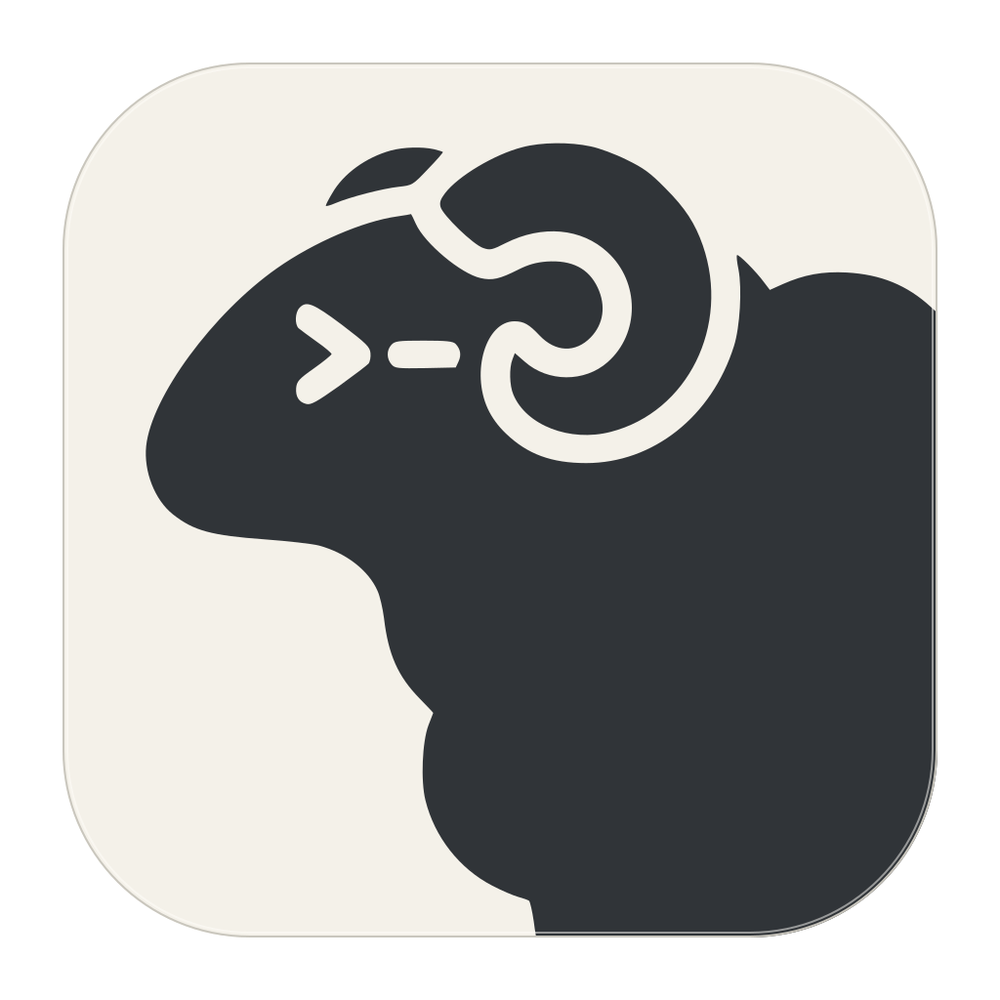

<p align="center">
  
</p>

# Herdr GPUI

[](https://github.com/penso/herdr-gpui/actions/workflows/ci.yml)

A native Rust/GPUI interface to local and saved SSH Herdr hosts. Workspaces and
worktrees are on the left, agents below them, and the active workspace's tabs
across the top. The center paints the daemon's terminal cells, including split
panes, without running another terminal emulator or wrapping the TUI.

The compact sidebar uses single-line labels, muted branches, status dots, and
independently scrolling spaces and agents sections, following Herdr's TUI.
Linked workspaces are nested beneath the main checkout using Herdr's repository
group metadata, not branch-name guesses. Parent arrows collapse/expand children
locally without closing sessions or changing the selected pane; a child without
an open parent stays visible at the top level. Tabs show titles without added numbers.

Space and agent indicators follow Herdr's activity semantics: filled yellow for
working, red for blocked, teal for an unseen completion, hollow green for idle,
and muted for unknown. Like the TUI, the GUI tracks completion acknowledgement
per client using state-change sequences and coherent surfaces. A new connection
starts with a seen baseline, so its dots can differ from a long-running TUI's
unread history. Activity is never guessed from terminal output.

The sidebar's `menu` opens an in-app popover with read-only settings information,
keybind help, GUI and daemon config reload, available-update information, and safe
detach/reconnect. Escape or clicking outside dismisses it; menu typing never
reaches the terminal. Update commands are displayed, not executed automatically.

This is an initial working macOS client with experimental Linux builds, not
complete TUI feature parity. The integrated Linux build and headless tests have
been verified on Ubuntu 24.04 ARM64; native Linux desktop behavior is not yet
verified.
Herdr owns terminal processes and session state; closing this app only detaches.
The Herdr checkout does not need to be modified or linked into this build.

## Installation

### macOS With Homebrew

Requires [Homebrew](https://brew.sh/) and macOS 15 Sequoia or newer, on Apple
Silicon or Intel. The cask installs the signed, notarized universal app.

**Availability:** the tap is created, but the cask becomes installable only after
the first successful release. Until then, use the [source build](#run).

```sh
brew install --cask penso/herdr-gpui/herdr-gpui
open -a Herdr
```

The fully qualified name automatically adds the
[`penso/herdr-gpui` tap](https://github.com/penso/homebrew-herdr-gpui).
You can also launch **Herdr** from Applications. To update or uninstall:

```sh
brew update
brew upgrade --cask penso/herdr-gpui/herdr-gpui
# Remove only the GUI app:
brew uninstall --cask herdr-gpui
```

Install the [Herdr daemon](https://herdr.dev/) separately. The cask does not
install or manage it; uninstalling the GUI leaves daemon sessions and shared
Herdr configuration intact.

### Direct macOS Download

Alternatively, download `Herdr-VERSION-universal-apple-darwin.dmg` from
[Releases](https://github.com/penso/herdr-gpui/releases), open it, and drag Herdr
to Applications. This installs only the GUI. Install the Herdr daemon separately;
the app can start an installed local daemon as described below, while the cask
does not manage it.

### Linux And Windows

Linux releases are experimental x86_64/ARM64 GNU/Linux tarballs built on Ubuntu 24.04,
not static or broadly portable binaries. Download
`Herdr-VERSION-x86_64-unknown-linux-gnu.tar.gz` or
`Herdr-VERSION-aarch64-unknown-linux-gnu.tar.gz` and `SHA256SUMS`, verify the archive
against its checksum entry, and extract its tree into a chosen prefix with `bin`
on `PATH`. The archive includes a desktop entry, icon, license and attribution.
An active X11 or Wayland desktop, Vulkan-capable driver, system fonts, glibc 2.39+
and the usual XCB/xkbcommon, Wayland, fontconfig, FreeType and OpenSSL runtime
libraries are required. On Ubuntu 24.04 a starting runtime set is:

```sh
sudo apt install libxcb1 libxkbcommon0 libxkbcommon-x11-0 libwayland-client0 \
  libx11-xcb1 libxcb-xkb1 libxcb-randr0 libxcb-shape0 libxcb-xfixes0 \
  libfontconfig1 libfreetype6 libssl3t64 libvulkan1 mesa-vulkan-drivers fonts-dejavu-core
```

This is not a tested compatibility promise for every Linux desktop or GPU.
Native Linux launch/input/IME QA is pending. Windows runs protocol tests only;
Windows GUI packaging, transport support, and installers are deferred.

## Run

Install Rust/rustup and, on macOS, the Xcode command-line tools. For Linux,
see the dependencies below. The repository pins Rust 1.96.1 and GPUI 0.2.2.
Install Herdr, then:

```sh
cargo run --locked --release -p herdr-gpui
# Or, with just installed:
just run
just run --session my-project
just run --socket /absolute/path/to/herdr-client.sock
```

`just run` uses the optimized release build for interactive performance. Use
`just run-debug` when debugging; unoptimized GPUI scene construction is notably
slower with a dense terminal on screen.

The explicit socket must be the binary **client** socket, not `herdr.sock`.
The app starts `herdr server` if the default or named-session local daemon is
absent, then waits up to 20 seconds without blocking the UI. A pulsing status
indicator and "Starting Herdr server..." message remain visible during startup.
Herdr must already be installed; discovery checks PATH and standard Homebrew,
Cargo, and `~/.local/bin` locations. If missing, an installation modal's **Install**
button opens [herdr.dev](https://herdr.dev/) without downloading or running an
installer. **QA > Show herdr non-detected modal** previews the warning without
disconnecting or changing detection. Explicit `--socket` and `--dev` targets
remain attach-only. The app never installs, stops, or upgrades your daemons.
Failed connections retry automatically; Terminal > Reconnect retries the selected
host immediately. Closing the app leaves daemon sessions running.

Use **Report issue** on the right of the status bar to open this repository's
GitHub issue forms. Redact secrets and private terminal content before submitting.

### Saved Hosts

Normal launches read Herdr's existing saved-host catalog at
`$XDG_STATE_HOME/herdr/client/endpoints.json` (default
`~/.local/state/herdr/client/endpoints.json`). `--dev` selects `herdr-dev` instead.
Manage this list with Herdr's `herdr machine` commands; GPUI reloads changes while
running. An explicit `--socket` launch stays isolated and does not load saved hosts.
Normal launches restore the choice in the adjacent `endpoint-selection.json`
once the saved host's snapshot is ready. Explicit host choices persist there;
other clients' later choices do not move this window's focus. Startup connection
delays and automatic fallback never overwrite the preference. Disabled/removed
choices fall back to Local (or a valid legacy catalog choice at startup).
`--socket` never reads or writes saved selection.

Spaces lists Local first, then collapsible saved-host groups in catalog order.
Enabled hosts connect in the background so their workspaces and agents stay
current. Selecting a remote workspace activates its terminal; input is held until
the destination surface is ready. Only the selected host receives terminal input.

SSH connects directly to each remote host, not through the local daemon. It uses
noninteractive SSH authentication and existing trusted host keys. Remote Herdr
must already be installed on a supported POSIX host; its `remote-client-bridge`
may start the named remote session. GPUI does not install remote software or
prompt for passwords/host trust. Configure and verify access with Herdr first.
Closing GPUI detaches all connections without stopping remote sessions.

New workspaces created through Herdr appear automatically while connected.
Revisioned snapshots are pushed by the daemon and applied by the GUI without a
manual refresh. The native integration test checks creation by a separate client,
including preservation of the GUI's current selection and connection. Observed
latency is tens of milliseconds locally, not an instant-delivery guarantee.

### Linux Builds

CI and releases target `x86_64-unknown-linux-gnu` and
`aarch64-unknown-linux-gnu` on native Ubuntu 24.04 runners. These are dynamically
linked GNU/Linux builds, not portable static binaries or AppImages; older glibc
distributions are not supported by this build baseline. Windows builds do not
currently exist.

On Ubuntu 24.04, install build dependencies with:

```sh
bash scripts/install-linux-deps.sh
just ci
just test-build
```

The script uses sudo/apt to install a C/C++ compiler, pkg-config, XKB/XCB,
FreeType/Fontconfig development libraries, and DejaVu fonts. Pinned registry
GPUI's default features enable both X11 and Wayland; no alternate GPUI fork,
nightly toolchain, or cross-compilation SDK is used.

Running the GUI requires an active X11 or Wayland desktop and working Vulkan
loader/driver, plus XKB/XCB, Fontconfig/FreeType, and DejaVu fonts. On Ubuntu,
runtime packages include `libxkbcommon0`, `libxkbcommon-x11-0`, `libxcb1`,
`libfontconfig1`, `libfreetype6`, `libwayland-client0`, `libvulkan1`, and
`fonts-dejavu-core`; install a Vulkan driver appropriate for your GPU
(`mesa-vulkan-drivers` for supported Mesa hardware). These libraries, drivers,
fonts, and Herdr itself are not bundled in release archives.

Extract the matching versioned Linux `.tar.gz` and run `bin/herdr-gpui` inside
the extracted directory. Linux defaults use DejaVu Sans Mono for terminal/sidebar
and DejaVu Sans for other UI text. Explicit font configuration is preserved.
The shortcuts documented as Cmd use **Super** on Linux, not Control, and may
conflict with desktop shortcuts. macOS global menus and Dock integration do not
exist on Linux; use the in-app controls and command palette.

Native Linux X11/Wayland launch, Vulkan rendering, clipboard, keyboard/IME,
scaling, and desktop shortcut behavior still need manual verification. Headless
tests and successful linking do not establish native desktop support.

### macOS App Bundle

On macOS, a Zed-style integrated title bar lightly blends the theme's surface toward white
above both the sidebar and tabs, retaining native traffic lights and the Herdr
window identity. Its upper-right circular user avatar is a placeholder for future
GitHub sign-in, with no authentication, network requests, or personal identity.
Double-click outside the avatar uses the macOS title-bar preference;
window dragging remains owned by AppKit. Windows/Linux retain their native frame
without an extra header. See the [native shell notes](crates/herdr-gpui/README.md#title-bar)
for layout coverage and remaining desktop QA.

`cargo run` and `just run` use the embedded Herdr ram Dock icon, with no runtime
asset paths or image-generation processes. To create a local Finder-launchable app:

```sh
just bundle
open target/release/Herdr.app
```

The bundle is named **Herdr** and contains only the release GUI executable,
`Info.plist`, and its native `.icns` icon. It starts an installed daemon if needed;
it does not bundle, install, or stop a daemon. This is a local unsigned,
unnotarized bundle, not a distribution/signing pipeline. Its version metadata lives
in `assets/macos/Info.plist` and should be updated for releases.

The ivory tile and upstream Herdr ram artwork and provenance are in
[`assets/icons`](assets/icons/README.md). Linux packages and the README use the
supplied PNG export; `just icons` regenerates the macOS ICNS from that PNG with
Swift/CoreGraphics and `iconutil`.

For a local signed/notarized universal DMG, use `just dmg 0.1.0` (matching the
manifest version). This requires both Rust macOS targets and ignored local signing
configuration; see [local DMG setup](scripts/release/README.md#local-dmg).
Artifacts go to `target/distribution/VERSION`; nothing is published.

### Worktree Builds

Builds from a linked Git worktree are deliberately unmistakable: a **red app
icon** and a persistent **amber banner** showing the build's
branch (or detached commit) and open PR number when available. This applies to
release-mode source runs as well as macOS bundles and Linux packages. The normal
checkout and published main builds keep the ivory icon and no banner. Linux
launcher icons are installed through the packaged desktop entry.

Identity is captured at build time, not inferred from the app's launch directory
or the terminal workspace. GitHub CLI PR lookup is optional and limited to two
seconds; missing `gh`, authentication, network, or an open PR simply omits the
number. Set `HERDR_BUILD_PR_NUMBER=123` when building to supply it explicitly, or
set it to an empty string to disable lookup. PR changes alone do not invalidate
Cargo's cache; change that override or rebuild after creating a PR.
`herdr-gpui --build-info` prints the embedded identity without launching the GUI.
See [build identity details](scripts/release/README.md#build-identity).

## GUI Configuration

Click **? Keybinds** at the bottom right of the status bar, or press `Cmd-/`,
to open the native shortcut reference. Press Escape, click outside the modal,
or use its close button to return to the terminal. Terminal input is blocked
while the modal is open. Its search field filters by action, section, or key
combination (for example `pane zoom` or `Cmd+Shift+P`).

`Cmd-,` opens Preferences with Appearance, Fonts, Configuration, and Connection
sections. The theme picker and GUI config reload are available directly from
Preferences; font values remain read-only and are edited in the config file.

Click **Theme** beside Keybinds to browse built-in themes and theme files discovered
in the Herdr and Ghostty theme folders. Type to filter names (case-insensitive),
hover a result or use Up/Down to preview it immediately, then press Enter or click
to save it. Filtering also previews the selected result. Previews never write
configuration. The saved theme is marked in the list. Escape, Close, or clicking
outside restores the appearance from before the picker opened. File loading and
saving run in the background; once a save begins, the picker waits for its result
before closing. Saving updates only `theme` in the GUI config, preserving comments
and other settings. Errors remain visible without moving the theme rows.

GUI settings live in `$XDG_CONFIG_HOME/herdr/config-gpui.toml`, falling back to
`~/.config/herdr/config-gpui.toml`. The GUI creates a commented default file if it
is absent, without overwriting an existing file. These settings are independent
of the daemon configuration and apply equally when connecting with `--dev`.

See the complete [example config](crates/herdr-gpui/config-gpui.example.toml).
Omitted settings keep their defaults, including individual fields inside a font
section. Unknown keys, empty font families, and invalid sizes are errors.

```toml
theme = "Nord"

[terminal]
family = "Menlo"
size = 14
```

| Section | macOS Font Family | Linux Font Family | Default Size |
| --- | --- | --- | --- |
| `sidebar` | `Menlo` | `DejaVu Sans Mono` | 12 |
| `tabs` | `.SystemUIFont` | `DejaVu Sans` | 14 |
| `terminal` | `Menlo` | `DejaVu Sans Mono` | 14 |
| `ui` | `.SystemUIFont` | `DejaVu Sans` | 12 |

Sizes are **logical pixels**, not points or physical display pixels. Fractional
sizes are supported; values must be finite and between 8 and 48 inclusive. Line
height scales as `size * 20 / 14`. Fonts must be installed locally; none are bundled.
Restart the GUI or use its **GUI config reload** action after editing. Reloading
daemon config is separate and does not apply these appearance settings. There is
no automatic file watcher.

### Themes

Built-in names are case-sensitive: `Default`, `Nord`, `Dracula`,
`Catppuccin Mocha`, and `Catppuccin Latte`. `Default` preserves the original
terminal background, foreground, cursor, ANSI/256-color palette and sidebar
surface/active/muted colors. Other themes derive chrome colors by blending the
background and foreground. Built-ins have small hardcoded palettes, not bundled
third-party assets; entries 16 through 255 retain the conventional color cube and
grayscale ramp.

`theme` also accepts an absolute path, a `~/` path, or a Ghostty theme filename.
Built-in names take priority; use an explicit path to select a file with the same
name. Named files are searched in this order:

1. `$XDG_CONFIG_HOME/herdr/themes` (or `~/.config/herdr/themes`).
2. `$XDG_CONFIG_HOME/ghostty/themes` (or `~/.config/ghostty/themes`).
3. `$GHOSTTY_RESOURCES_DIR/themes`, when set.
4. `/Applications/Ghostty.app/Contents/Resources/ghostty/themes`.
5. `$XDG_DATA_HOME/ghostty/themes` (or `~/.local/share/ghostty/themes`).
6. `ghostty/themes` under each `$XDG_DATA_DIRS` entry (defaults to
   `/usr/local/share` and `/usr/share`).

Ghostty files support `background`, `foreground`, `cursor-color`, and
`palette = INDEX=COLOR` for indices 0 through 255. Colors must be exactly six hex
digits, optionally prefixed with `#`. Blank lines and full-line `#` comments are
allowed; inline comments and named colors are not supported for color values.
Malformed supported colors report the file and line number. Other settings are
ignored, including includes and commands: theme loading does not execute them.
Repeated colors use the last value. Unspecified colors retain defaults, except
that an omitted cursor color follows the theme foreground.

## Controls

| Control | Action |
| --- | --- |
| Sidebar workspace/agent | Focus its workspace or pane |
| Top tab / terminal pane | Focus the tab or pane |
| Persistent + beside tabs | New tab in the current workspace |
| Tab close cross | Confirm closing that tab without focusing it |
| Right-click tab | Rename |
| Cmd-N | New workspace using daemon directory policy |
| Cmd-T | New tab |
| Cmd-D / Cmd-Shift-D | Split right / below |
| Cmd-Shift-] / Cmd-Shift-[ | Next / previous tab |
| Cmd-1 through Cmd-9 | Focus the corresponding numbered tab in the current workspace |
| Cmd-Alt-Left/Right/Up/Down | Focus a pane in that direction |
| Cmd-Alt-] / Cmd-Alt-[ | Next / previous pane in the current tab |
| Cmd-Shift-Enter | Toggle focused pane zoom |
| Cmd-W / Cmd-Shift-W | Confirm closing the focused pane / tab |
| Cmd-P | Workspace picker |
| Cmd-Shift-P | Command palette: native actions and configured daemon entries |
| Cmd-B | Toggle the sidebar locally |
| Cmd-, | Settings |
| Cmd-/ | Native shortcut reference |
| Wheel / trackpad | Scroll the hovered terminal through Herdr |
| Cmd-V | Semantic paste |
| Cmd-Q | Quit the GUI, leaving terminals running |

The native File and Terminal menus expose the creation and navigation actions.
Terminal keyboard input and committed Unicode text go directly to Herdr's
semantic input protocol.

The command palette includes native actions (including unbound Themes and
Reconnect) and configured daemon command entries. Cmd-P opens the workspace
picker, not the command palette. Cmd-B only changes this client's sidebar
visibility; it does not change daemon state.

Closing a pane or tab requires confirmation because it can terminate running
processes. **Cancel is selected by default**: Enter alone cancels; press Tab then
Enter to select and confirm Close. Quitting the GUI remains a detach operation,
not a pane/tab close.

## Structure

- `crates/herdr-protocol`: locally maintained generation-1 wire types, fixtures,
  framing and surface validation. See its `NOTICE.md` for upstream provenance.
- `crates/herdr-client`: bounded background socket transport, capability
  negotiation, ordered commands, boot fencing, and full text-surface assembly.
- `crates/herdr-gpui`: native shell, live state, input routing and GPUI canvas.

Following Arbor's approach, dependency versions live at workspace level and
blocking I/O stays off the GPUI thread. This build uses registry GPUI, not Zed's
editor crates or a dependency on a sibling checkout.

## Verification

```sh
just ci
just build-release
just test-build
# Optional, requires an installed Herdr executable:
just test-live /opt/homebrew/bin/herdr
# Native GUI integration; opens a temporary window on the active desktop:
just test-gui /opt/homebrew/bin/herdr
# Native sidebar text/glyph regression, no daemon required:
just test-sidebar
# Native hover/scroll benchmark with a 30 ms p95 CPU scene budget:
just test-perf
```

The live test creates a private temporary HOME/config/socket environment,
starts its own daemon, tests terminal input/output, creation/navigation, resize,
and detach/reconnect, and cleans up only that daemon. It is ignored by default.
It has been exercised against Herdr 0.9.1. Normal tests use fixtures/mock peers
and require no running daemon.

The native GUI test dispatches real GPUI keybindings and text input, checks the
state consumed by the window, and fails on status-bar errors. It covers tab and
workspace creation/navigation, both split directions, shell output, native window
resize, and reconnect with fresh input. It verifies that the isolated daemon
survives GUI exit. The `integration-test` feature enables this harness only for
test builds; it is not enabled by `just run`.

This tests the native app and GPUI event routing, but does not replace screenshot
comparison or OS-level keyboard/IME delivery testing.

### Continuous Integration

GitHub Actions checks formatting, denies Clippy warnings, and runs the tests with
both default and all features on macOS and native Ubuntu 24.04 x86_64/ARM64.
The tests include real executable CLI checks for
help, malformed arguments, conflicting options, and test-mode gating, with a
timeout to catch startup hangs. These checks do not open windows.

CI jobs run only for `penso` in this repository: owner-authored internal PRs can
run audit/test jobs, but optimized release builds run only on `main`, never PRs.
Outside-contributor and Dependabot PR jobs are skipped; review changes and bring
them onto an owner-controlled branch for validation. Do not interpret skipped jobs
as a successful test run. GitHub also requires approval for all external contributors.
The required PR checks are `Workflow Security` and `Format, lint, and test`;
the main-only `Release (arm64)` / `Release (x86_64)` jobs are not PR requirements.

A headless GPUI layout regression also renders the actual sidebar with 40
workspaces and short/long agent labels. It checks shaped text, not just container
widths: short names must remain intact, long names must retain a readable prefix
and ellipsis, and the agents section must stay visible. This catches premature
text truncation that protocol and action-dispatch tests cannot detect.

`just test-sidebar` complements that mock-platform test with the actual macOS
font renderer and full application layout. It checks native glyphs and clipping
over 12 draws at four window sizes. This catches truncated font runs that the
mock text system does not model. It requires an active desktop, but uses only
fixture data and never connects to your daemon. Its process uses the shared
cleared-environment sandbox; the fixture catalog and synthetic hosts use unused
explicit socket targets, with polling stopped and no saved-state reads or writes.
On macOS, exact-view AppKit clicks verify host selection and return, disabled
selection, collapse without navigation or composition loss, agents remaining
visible, duplicate workspace/pane ID routing, and endpoint-scoped repository
collapse. A separate key window guards against accidentally targeting global
focus. Native glyph probes check long host/agent labels at 480px and 360px window
widths, plus wider/narrower sidebar preferences and restoration after truncation.
Host and agent glyphs also run with 16px/20px sidebar fonts and Nord, then restore
the default theme and 12px font.
Independent list offsets are checked through GPUI scroll handles and native
draws, not physical wheel/trackpad delivery. Routing checks stop at the queued
navigation target; they do not claim daemon acknowledgement or SSH coverage.
Menu keyboard isolation and outside dismissal remain covered. This is not a
screenshot/pixel comparison or OS-level IME test.

On macOS this also verifies that the running application's native Dock image is
valid and 1024x1024; a normal unit test checks the embedded PNG header/dimensions.

### Performance

`just test-perf` opens a daemon-free native fixture with a dense 160x50 terminal,
40 workspaces, and 40 agents. It dispatches real window-local mouse/scroll events
and measures cold frames, warm hover, and both sidebar lists' scrolling. It also
asserts that unchanged terminal cells need zero new text-shaping calls, validates
batched background counts, and compares cached glyphs with freshly shaped ones.

On the development M4 Max, caching and background batching reduced release hover
p95 from about 51 ms to 12 ms, and scrolling from 56 ms to 14 ms. The benchmark
measures CPU event-to-scene construction, not GPU completion or pointer-to-screen
latency. Use `just test-perf 50` to set a different calibrated budget; native tests
remain opt-in rather than imposing machine-dependent timings on hosted CI.

See [PERFORMANCE.md](crates/herdr-gpui/PERFORMANCE.md) for the before/after results,
reference mode, workload, deterministic checks, and remaining limitations.

Separate Apple Silicon/Intel macOS and x86_64/ARM64 Linux jobs build optimized
executables and run the CLI tests against those release binaries. CI validates
builds but does not publish distributable binaries. The separate manual release
workflow described below handles packaging, dependency notices, signing, and
notarization.
GPUI compiles its Metal shaders at runtime, so CI does not need the separate
build-time Metal compiler download.

The live protocol and desktop GUI tests are deliberately ignored in hosted CI:
they require an explicitly selected Herdr binary, and the GUI test also needs an
active desktop. Run `just test-live` and `just test-gui` locally as shown above.

## Sidebar Width

Workspace titles show the GitHub organization or owner avatar, resolved from
the local repository's `origin` remote. Git lookups and avatar downloads run
in the background, with results shared per owner for the app session. The
GitHub mark is used while loading or when an avatar is unavailable. No GitHub
token is needed; avatar requests go to `avatars.githubusercontent.com`.
Saved-host workspaces use the GitHub fallback mark: their remote paths are never
looked up on the local filesystem.

Drag the sidebar's right edge to resize it; double-click the divider to restore
the default width. The terminal resizes automatically. Width is remembered per
local daemon socket in `$XDG_STATE_HOME/herdr/gpui/local-<socket-hash>.json`, defaulting
to `~/.local/state/herdr/gpui/`. These logical-pixel preferences are separate
from the TUI's column-based settings. Narrow windows temporarily limit the
displayed width without replacing your saved preference.
Saves run in the background and continue after window close while the app remains
alive. App exit does not wait for pending writes, so the latest change may be lost.
The width applies to all host groups in the window; narrow sidebars hide host
status text to leave room for labels.

## Release Operations

Releases are **manual only**. `.github/workflows/release.yml` has no push, tag,
pull-request, or release-event trigger. Both the original actor and rerun actor
must be `penso`, the repository must be `penso/herdr-gpui`, and the workflow must
run from `main`. A tag push alone cannot publish anything.

### Protection Setup

Before the first dispatch, configure these settings on GitHub. Environment names
in YAML alone do **not** enforce approval; do not dispatch until protection is set.

1. Protect `main` against unreviewed changes, deletion, and force pushes. Review
   changes to this workflow, packaging scripts, cask template, and dependencies
   before merging. Only trusted code from `main` may reach a signing runner.
2. Create the `release` environment with `penso` as its sole required reviewer,
   selected deployment branches restricted to `main` (no tags), and administrator
   bypass disabled. Allow self-review: the only permitted dispatcher is also the
   required owner reviewer. Signing and publication both use this environment;
   inspect the run and immutable SHA before approving pending deployments.
3. Put `MACOS_CERTIFICATE_P12_BASE64`, `MACOS_CERTIFICATE_PASSWORD`, and
   `APPLE_API_PRIVATE_KEY` in **release environment secrets**. The private key is
   literal multiline `.p8` contents. Put `APPLE_API_KEY_ID`, `APPLE_API_ISSUER_ID`,
   and `MACOS_SIGNING_IDENTITY` in **release environment variables**, using the full
   Developer ID Application signing identity. Do not put signing credentials in
   repository-wide secrets. See the [script interfaces](scripts/release/README.md)
   for credential formats and temporary-keychain cleanup constraints.
4. Create a separate `homebrew` environment with the same owner review, main-only
   branch policy, self-review allowance, and no administrator bypass. Create the
    public `penso/homebrew-herdr-gpui` tap with an initialized default branch.
    Disable Actions in the tap and do not add workflows there. Generate a dedicated
    Ed25519 SSH key (never reuse a personal key), register its public key as a
    write-enabled deploy key **only on that tap**, and store its literal multiline
    private key as `HOMEBREW_TAP_SSH_KEY` **only in the homebrew environment**.
    No PAT is needed. The deploy key grants repository-wide write access to the tap,
    not path-level access, and grants no access to the source repository or other
    repositories. The final step alone receives it, clones with strict GitHub host
    verification using HTTPS API metadata, stages only `Casks/herdr-gpui.rb`, and
    pushes a conventional commit to the resolved default branch (skipping unchanged
    content). Temporary key files are permission-restricted and trap-cleaned; no
    Git credentials or global author configuration are persisted. Its built-in
    token remains Contents read-only. Ensure tap branch rules permit this update;
    revoke the tap deploy key and replace the environment secret when rotating it.
5. Ensure repository policy permits the publication job's built-in token to write
   contents and create `vX.Y.Z` tags/releases. All other jobs have Contents read
   only; the workflow default is `permissions: {}`. Use disposable hosted runners,
   not shared self-hosted runners with untrusted processes or concurrent keychain
   operations. If your GitHub plan cannot enforce required environment reviewers,
    do not treat this pipeline as approval-protected or enable production secrets.
6. Enable immutable releases and protect `v*` tags against updates and deletion,
   without preventing creation of new version tags. Upload and verify every asset
   while the release is still a draft: published immutable assets cannot be replaced
   or extended. Restrict `main` updates to trusted administrators and retain its
   PR/audit/test rules; do not add additional administrators without reviewing this
   trust boundary.

### Dispatch And Recovery

Update `[workspace.package].version` in `Cargo.toml` and its lockfile metadata as
needed, review and merge all release inputs into `main`, then use a clean local
`main` checkout at exactly GitHub's current main HEAD. With `gh` authenticated as
`penso`, `git`, `jq`, `openssl`, and `just` installed:

```sh
just release-check
just release 0.1.0
```

The helper rejects nonnumeric `X.Y.Z` versions, leading zeros, dirty trees,
non-main checkouts, a different origin, or a HEAD differing from GitHub's main.
It queries GitHub without fetching, moving branches, or editing files. The
exported recipe argument is passed as data, not interpolated shell. It dispatches
`release.yml` explicitly on `main` with `VERSION`, `expected_sha`, and a random
`request_id`; matches the unique run name plus SHA; and watches that run through
its conclusion. Approval waits may require a second browser/terminal session.
The Actions UI can also dispatch with the version and full SHA; `request_id` is
optional there. A concurrent main update causes validation to fail rather than
silently releasing a different commit.

The workflow checks the version against the workspace manifest and freezes the
validated SHA for every checkout. Secret-free jobs run macOS formatting, Clippy,
default/all-feature tests, native ARM/Intel optimized builds with a macOS 15.0
deployment target, and release CLI tests. Native Ubuntu 24.04 x86_64/ARM64 runners
run the same Rust gates and release CLI tests before packaging; Windows tests only
`herdr-protocol`.
No opt-in live-daemon or desktop tests are enabled. Signing downloads only the
current run's two macOS binaries into separate paths and calls the existing
packaging/signing scripts without launching either executable. Signing secrets
are scoped only to the signing step, not tests or builds.

The distinct `Release Workflow Security` audit gates validation and all subsequent
jobs without replacing CI's required `Workflow Security` check. A secret-free
metadata job generates a locked CycloneDX SBOM covering the four release targets
and their build dependencies. A separate owner-approved OIDC job signs the final
DMG, both Linux archives, and SBOM with Sigstore and attests their provenance. Builds
restore no caches; Apple credentials are unavailable to metadata/OIDC jobs.

Publication requires exactly those four base files and their `.sha256`, `.sha512`,
`.sig`, and `.crt` sidecars, plus `SHA256SUMS` covering all 20 files. It refuses any
existing `vVERSION` tag or release, creates a tag at the validated SHA, and uploads
all 21 assets into a draft. Enable GitHub immutable releases before dispatch.
It checks the exact
draft asset set and downloads it again to verify checksums before making it
public. The separately approved Homebrew job runs only after publication and
renders its cask using the checksum of the **downloaded published DMG**, verified
against the published checksum manifest. No draft or unsigned artifact is used
by the tap.

Do not blindly redispatch after a timeout or partial failure. The helper prints
its unique request ID; inspect Actions for that request before trying again.
Failed publication may leave a tag and/or draft and intentionally will not
overwrite either. Inspect the artifact set and failure, then explicitly decide
how to recover the tag/draft or choose a new version. If only the tap update
fails, the published release remains valid; review and rerun only the failed job
as `penso` and approve its environment again. Do not rerun successful publication.
Tap reruns reject downgrades and skip only byte-identical same-version casks.
If the tap is newer, leave it intact; changed same-version assets require a new
release version. Review and repair malformed existing cask versions before retrying.
Concurrency serializes releases and does not cancel an active signer, but GitHub
may replace an older pending run with a newer dispatch, so dispatch one at a time.

### Release Validation

To verify a published release, install Python 3.11+, `gh`, and cosign 2.x, then:

```sh
bash scripts/verify-release.sh --version v0.1.0
# Prefer pinning the independently reviewed source commit:
bash scripts/verify-release.sh --version v0.1.0 --sha FULL_COMMIT_SHA
# Basic GitHub provenance check:
gh attestation verify Herdr-0.1.0-universal-apple-darwin.dmg --repo penso/herdr-gpui
```

The script checks the exact asset/checksum set and requires Sigstore and provenance
from this repository's `release.yml` at `refs/heads/main`, bound to the release tag's
commit. It fails on missing sidecars or verification errors. Checksums alone do
not authenticate a download. See [SECURITY.md](SECURITY.md#verifying-a-release) for
the trust policy and optional local-only GPG approval. Supplemental `.asc` files
are shared separately, never uploaded after publication to an immutable release;
no private GPG key is placed in CI.

`just release-check` requires Python 3.11+, `jq`, `actionlint`, and `zizmor`. It
runs shell syntax checks, mocked packaging and artifact/security tests, workflow
lint/audits, and diff whitespace checks without remote mutation. See
[`scripts/release/README.md`](scripts/release/README.md) for tool prerequisites.

Before this merge, local release validation on 2026-09-20 built both macOS
architectures and produced a signed/notarized/stapled universal DMG. The mounted
app and DMG passed signature,
ticket, and Gatekeeper checks; CLI checks and a three-second isolated process-start
smoke passed. This was not visual/input QA or a published GitHub release.
Ubuntu 24.04 amd64 Docker validation passed Clippy, release linking/CLI tests, and
archive extraction. Default/all-feature tests each hit one emulation-specific
nonexistent-executable spawn failure (`missing_executable_is_actionable`); all
remaining tests passed. Native x86_64 hosted CI must confirm the unmodified test.
After integration, the combined branch passed formatting, Clippy,
default/all-feature tests, release linking and all six release CLI checks on
macOS and native Ubuntu 24.04 ARM64 (isolated container). These checks do not
validate native Linux desktop behavior or hosted release publication.
Hosted publication, Sigstore/provenance verification of published artifacts,
Homebrew install/upgrade/uninstall, and native Linux UI QA remain pending.
No release is triggered by adding these files.

Release trust/manifest regression tests run without credentials or signing:

```sh
python3 scripts/release/test-release-security.py
# Also exercise installed cargo-cyclonedx 0.5.9 in an isolated workspace:
HERDR_TEST_SBOM=1 python3 scripts/release/test-release-security.py
```

## Next Milestones

- Selection/copy, hyperlink interaction, richer mouse support, and inline IME.
- Workspace/pane rename dialogs, workspace deletion, and full worktree/agent management.
- Editable settings and bundled fonts.
- Optimized terminal painting and graphics support.
- First approved signed release, native distribution QA, and broader remote-platform support.
- Native Linux desktop verification.

Current rendering defaults to Menlo on macOS and DejaVu Sans Mono on Linux,
with configurable fonts and themes. Images and terminal
notifications/clipboard writes are deliberately not executed. See
[`crates/herdr-gpui/README.md`](crates/herdr-gpui/README.md) for the detailed scope.

## License

Apache-2.0. See [LICENSE](LICENSE) and [NOTICE](NOTICE), plus the
[upstream protocol attribution](crates/herdr-protocol/NOTICE.md) for the
vendored parts of `herdr-protocol`.
