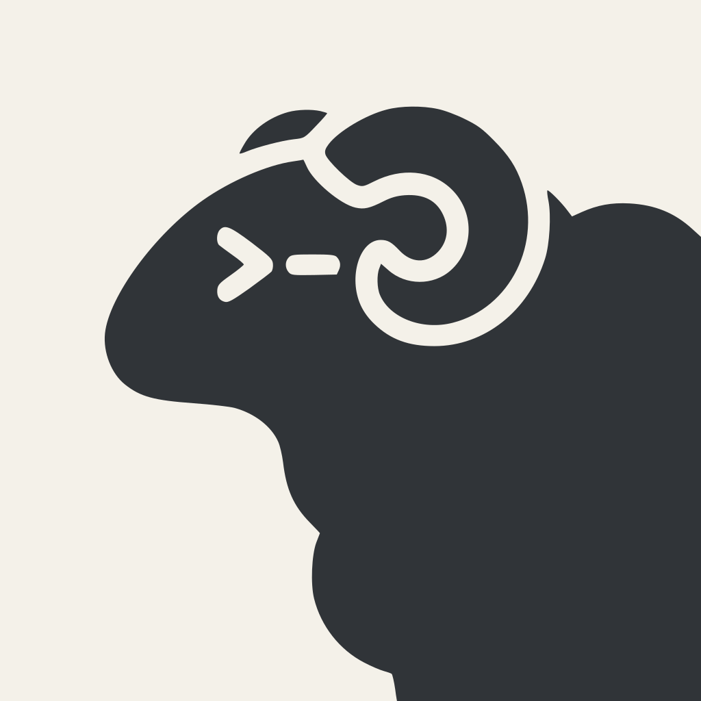

# Herdr Icon

The application icons combine Herdr's ram and terminal prompt with flat ivory
and graphite colors, without window controls, gradients, or shadows. The ram path is adapted from
[Herdr's logo](https://github.com/herdrdev/herdr/blob/HEAD/assets/logo.svg),
licensed under Apache-2.0. Changes include placement, scaling, flat colors,
and the surrounding tile. See the root [NOTICE](../../NOTICE)
and [LICENSE](../../LICENSE) for distribution attribution and license terms.
Transparent margins keep the rounded tile aligned with other macOS Dock icons.

| macOS / README | Linux |
| --- | --- |
|  |  |

`herdr-ui-icon-clean.svg` is the rounded tile source artwork;
`herdr-icon-square-clean.svg` is the full-square variant.
Their generated 1024x1024 PNG exports serve the README and unbundled macOS runs
(rounded), and Linux packages (square). On macOS, install the SVG renderer with
`brew install librsvg`, then run `just icons` after changing either SVG.
The generator uses `rsvg-convert` to rasterize the vector artwork directly at
each iconset resolution, rather than downsampling a PNG, and Apple's `iconutil`
to package `Herdr.icns`. It also regenerates the PNG exports.
Assets are checked in, so ordinary builds do not require Swift or librsvg.

The same generator uses CoreImage to map each rendered image's luminance to a red
palette, retaining transparency, producing `herdr-worktree-1024.png`,
`herdr-square-worktree-1024.png`, and `Herdr-worktree.icns`.
These derived assets identify linked-worktree builds;
the normal artwork remains unchanged. macOS development runs select the embedded
PNG at compile time, while macOS/Linux packaging reads the executable's build
identity to select the matching icon, even when packaging in another checkout.

`plus.svg` and `close.svg` are original tab-control artwork, reused by the
workspace menu alongside the original `pencil.svg` (rename), `trash.svg`
(delete checkout) and `chevron-up.svg` / `chevron-down.svg` (fold and unfold a
worktree group); `git-branch.svg` is original artwork for the titlebar's Git
actions button; `user.svg` is an
original generic silhouette for the future account placeholder, not a personal
identity or GitHub logo. All of them are embedded through a
minimal GPUI asset source. GPUI renders them as SVG masks tinted with the current
theme foreground, rather than fixed-color cached images.
